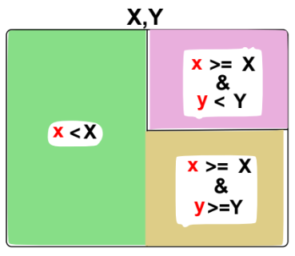
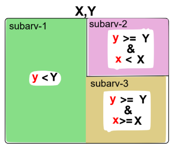

# University projects

In this repository are located some of the projects I developed for my university classes. Most of them (if not all) output reports in Portuguese, but are ~~almost~~ fully explained in English in this README; and I should warn you that I haven't gone through all of them before uploading them to my GitHub, although I can assure you they work :sweat_smile:

Originally, this was intended to be my only university-related repository. However, I decided it'd be better to organize my projects separately. Most of the projects here are from my first and second years, so they are relatively basic.

## Computer Architecture :cd:

### MIPS assignments (Assembly)

> 3rd semester (2022)

Since this was my very first time dealing with Assembly (and earlier in this same semester, Machine Code), the folder won't contain all of my assignments, but the most interesting ones shall be included nonetheless.

> 4th semester (2023)

This folder includes some more difficult exercises, covering topics such as dynamic memory allocation and file handling.

## Data Structures :desktop_computer:

All assignments were developed using C language.
There was also an special rule for all assignments that structs shouldn't be declared in the .h file, making the usage of void* frequent.

> 2nd semester

### T1

In this assignment, since it was my very first data structures project, I mainly learned how to manipulate given paths in argv in order to work with files (reading and writing) and generate SVG files with them; also I had to use a doubly linked list for storing parameters from a .geo file:

| COMMAND |             PARAMETERS              | DESCRIPTION                                                  |
| :-----: | :---------------------------------: | :----------------------------------------------------------- |
|    c    |      i, x, y, r, border, fill       | Draws a circle centered at (_x_, _y_) with ray _r_, identifier _i_ and colored by _border_ and _fill_ colors |
|    r    |     i, x, y, w, h, border, fill     | Draws a rectangle with (_x_, _y_), (_x_ + _w_, _y_), (_x_, _y_ + _h_) and (_x_ + _w_, _y_ + _h_) vertexes, identifier _i_ and is colored by _border_ and _fill_ colors |
|    l    |      i, x1, y1, x2, y2, color       | Draws a line that links a point (_x1_, _y1_) to another point (_x2_, _y2_), has identifier _i_ and color specified by the parameters |
|    t    | i, x, y, border, fill, anchor, text | Draws a text at (_x_, _y_) that can have an anchor at the beginning, middle or end, has identifier _i_ and color specified by the parameters |

After reading the first query file and storing all parameters in the **doubly linked list**, a SVG file should be generated, containing all geometric shapes specified at .geo file. Following that, there could be a .qry file with some other functions:

| COMMAND |       PARAMETERS        | DESCRIPTION                                                  |
| :-----: | :---------------------: | ------------------------------------------------------------ |
|   inp   |            i            | Inserts the coordinates of the geometric shape identified by _i_ at a **static circular queue**; in case of lines, inserts the coordinate with lesser _x_, if they're equal, inserts the coordinate with lesser _y_ |
|   rmp   |                         | Removes from database the first coordinate inserted at the queue |
|   pol   |  i, d, e, border, fill  | Draws the polygon with vertexes at coordinates that are in the queue. The lines that compose the polygon have identifiers starting at _i_ and there's a distance _d_ between the fulfillment lines, which have a thickness _e_, of the geometric shape. The polygon's color is given by border and fill refers to the fulfillment lines' color |
|   clp   |                         | Removes from database all coordinates of the polygon         |
|   sel   |       x, y, w, h        | Selects all geometric shapes fully inside the area specified by the parameters; doesn't consider previous selections |
|  sel+   |       x, y, w, h        | Similar to sel, but it considers previous selections, adding new geometric shapes to the selected ones |
|  dels   |                         | Removes from database all geometric shapes that were selected |
|   dps   | i, dx, dy, border, fill | Generates new geometric shapes, similar to those that were selected, but located at (x', y'), x' = x + dx, y' = y + dy; the identifiers start at i and are incremented sequentially |
|   ups   | border, fill, dx, dy, n | Changes the colors and positions (transferring the coordinates like dps function does, but also considering y' = y + m * dy, m is the number of times that geometric shapes were changed) of n geometric shapes before (n < 0) or after (n > 0) the last that was selected by sel or sel+ |

So after reading and executing all functions at .qry file, there should be another SVG file and a report (.txt) of the processes executed.

### T2

This assignment took me way less time than the previous, since that were many functions I could use from the other project; still, they weren't the same and instead of working with a doubly linked list, I had to store all the following parameters inside a ternary search tree that should look like this:

| COMMAND |             PARAMETERS              | DESCRIPTION                                                  |
| :-----: | :---------------------------------: | :----------------------------------------------------------- |
|    c    |      i, x, y, r, border, fill       | Draws a circle centered at (x, y) with ray r, identifier i and colored by border and fill colors |
|    r    |     i, x, y, w, h, border, fill     | Draws a rectangle with (x, y), (x + w, y), (x, y + h) and (x + w, y + h) vertexes, identifier i and is colored by border and fill colors |
|    l    |      i, x1, y1, x2, y2, color       | Draws a line that links a point (x1, y1) to another point (x2, y2), has identifier i and color specified by the parameters |
|    t    | i, x, y, border, fill, anchor, text | Draws a text at (x, y) that can have an anchor at the beginning, middle or end, has identifier i and color specified by the parameters |

Each geometric shape would represent a type of navy equipment and after generating the first SVG with .geo file, there could be a .qry file with some functions:

| COMMAND |    PARAMETERS    | DESCRIPTION                                                  |
| :-----: | :--------------: | ------------------------------------------------------------ |
|   na    |        v         | Assigns the level of aggressiveness v to attack areas        |
|   tr    |       x, y       | Torpedo that destroys all geometric shapes that has (x, y) as an internal point. There should be a red * if any shape was hit - in case of more than one, there should also be the number of shapes hit - or a gray * otherwise |
|   tp    | x, y, dx, dy, id | Torpedo that generates a clone of each geometric shape that has (x, y) as an internal point. There should be a red @ if any shape was hit or a gray @ otherwise; the clones have coordinates (x', y'), x' = x + dx, y' = y + dy, and their identifiers start at id and are incremented sequentially |
|   be    |    x, y, w, h    | Radiation bomb at area specified by parameters. Draws the area in red and any geometric shape fully inside that area should have a red . at its anchor and has its protection level decreased; if it reaches 0, then the shape should be removed from the SVG and set as inactive |

In order to make some calculations, it was given the following table:

| GEOMETRIC SHAPE | PROTECTION LEVEL | INACTIVATION POINTS | DESTRUCTION POINTS |
| :-------------: | :--------------: | :-----------------: | :----------------: |
|     circle      |        5         |         30          | 75 / (π * r² / 5)  |
|    rectangle    |        50        |         50          |  90 / (w * h / 5)  |
|      line       |        60        |         75          |        150         |
|      text       |        60        |         90          |        500         |

So after reading and executing all functions at .qry file, there should be another SVG file and a report (.txt) of the processes executed and the final score.

### Extra assignment

This one was a little bit more complicated, due to the number of data structures that were involved in the implementation: list, queue and a xyy ternary search tree variant, called yxx tree:

Basically, it was [T1](#T1) in terms of commands, but this time there was a mandatory .h file for yxx tree that should be followed and couldn't be modified. Also, the ternary search tree should contain the nodes from .geo file, working like a database for consulting.

> 3rd semester (2022)

### T3

This project was named "Pirate Fishing" and the basic components from .geo file - circles, rectangles, lines, texts - were the same as usual. Although this time the data structure in which the elements were stored was a Red Black Tree. Also, each of the geometric shapes represented an element of the fishing:

| GEOMETRIC SHAPE |     ELEMENT    |
| :-------------: | :------------: |
|    rectangle    |      ship      |
|    text >--<    |     lobster    |
|     text $      |      coin      |
|  any other text | algae, rubbish | 
|      circle     |      fish      |
|       line      |     shrimp     |

Each of the ships can move, throw nets or even fire cannons; their actions cost a certain quantity of energy or can result in the gain of it:

| ACTION |      ENERGY      |
| :----: | :--------------: |
|  Move  |  E = distance/5  |
| Throw  | E = a/25 * d/5   |
|  Shot  |       E = d      |

When throwing a net, the direction of its launch should be specified. There's also a quantity of coins - they give +5 energy - for each animal fished:

|  ANIMAL  | COINS |
| :------: | :---: |
|  lobster |  $20  |
|  shrimp  |  $1   |
|   fish   |  $5   |

Lastly, the .qry file contains actions:

| COMMAND |     PARAMETERS     | DESCRIPTION | .txt REPORT                                                                       |
| :-----: | :----------------: | :--------------------------------------------------------------------------------------------------------------------------------------------------------------------------------: | :---------------------------------------------------------------------------------------------------------------------------------------------: |
|    e    |         v          | Energize all the ships to level v                                                                                                                                                  | IDs and data of the rectangles (ships)                                                                                                          |
|    mv   |     i, dx, dy      | Move the shape with id 'i'                                                                                                                                                         | Data of the shape identified by 'i', including its initial and final positions                                                                  |
|    lr   | i, lado, d, w, h   | Launch a net of dimensions (w,h) at a distance d from the specified side of the ship with id i, if the ship has enough energy. The captured elements are accounted for and removed | Data of the captured elements, including their values, the total $ for this capture and the sum of $ and the energy before and after the launch |
|    d    |    i, lado, d      | Fire the cannon of ship i from the specified side, if the ship has enough energy. If it hits a ship, that ship is destroyed                                                        | The impact point. If a ship is hit, also report the ship's data                                                                                 |
|    mc   | dx, dy, x, y, w, h | Move all fish that are within the region (x, y, w, h) by dx and dy                                                                                                                 | Data of moved fish, including their initial and final positions                                                                                 | 

## Discrete Mathematics :triangular_ruler:

### Linear congruence applications (Python)

> 2nd semester (2022)

This project embraces linear congruence applications, such as: ISBN-10, 10-digit barcode and Cadastro de Pessoas Físicas (CPF, commonly used in Brazil to register one's data).